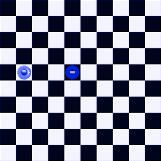
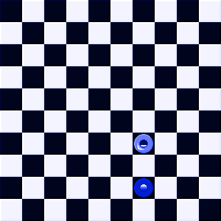

# DiscorBot
> English not my first language

Simple discord bot that let's you play a game with a bunch of people

## Table of contents
- [Introduction](#introduction)
- [Technologies](#technologies)
- [Ilustrations](#illustrations)
- [Game Rules](#game-rules)
- [To-Do](#to-do)

## Introduction
This project is a practice to create a discord bot, called _BattleBot_. In particular, this bot let's you play a game in which a player must win against everyone else.

## Technologies
- Python v3.8.5
- Discord\.py v1.4.1
- Pillow v8.0.1

## Illustrations

| | |
|:---:|:---:|
|  |  |

## Game Rules
- Each time a round starts, the position of everyone in the board is revealed to you.
- Every round, you have the option to do a maximum of 3 actions:
    - move: Called using "!action move &lt;dir&gt;", were "dir" is either w, a, s, d. (No uppercase).
    - shoot: Called using "!action shoot". Your characters shoots using the rotation it currently has. If it impacts a player, that enemy loses 1hp.
    - aim: Called using "!action aim &lt;deg&gt;", were "deg" is the angle (In degrees) where your aiming to (Only integer values).
- The actions mentioned are in order of priority, meaning that among the first actions realized by every player, the "move" actions will be done firts, followed by "shoot" actions and finally "aim" actions.
- This behavior is repeated for every second and every third action in every round.
- Invalid actions are not considered, but valid actions that contain invalid values will be considered (For example, calling "!action move t" will result in no movement).
- Edges of the grid are connected, meaning that crossing the left edge takes you to the right edge. This behavior works with the top edge and bottom edge too (This does not affect the "bullets" shot using "shoot" actions).
- Your character is the brightest circle in the grid, the rest are the enemies.
- Each player has 3hp that represents your life points, and is visualized as the inner circle in every character. Once they get to 0, you're out of the game.
- Your angle of aim is represented by the arrow inside your character (You can only see your line of aim)

## To Do
- Change "!action &lt;type&gt; &lt;val&gt;" to "!move &lt;dir&gt;", "!shoot" and "!aim &lt;deg&gt;"
- Fix non-appearing victory message to the winner
- Fix bug where aiming at 45° misses, but aiming at -45° does not